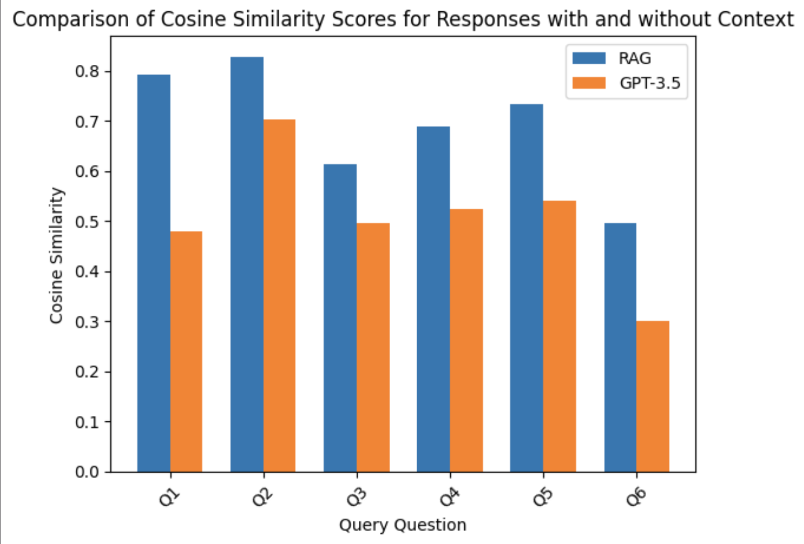

# Marvel Universe Data Project

This project is an extensive collection and analysis of data related to the Marvel Cinematic Universe (MCU), focusing on recent movies and TV shows. It utilizes web-scraped data from Wikipedia and the Marvel Cinematic Universe Wiki - Fandom, incorporating summaries and actor information for selected movies and shows. The project includes data extraction, processing notebooks, utility scripts, and a Flask web application for interactive querying.

## Purpose

The project aimed to evaluate the performance of the Retrieval-Augmented Generation (RAG) model, particularly when accessing information from Marvel movies and TV shows not included in the GPT-3.5 Turbo's training data. The objective was to assess and compare the cosine similarity scores of responses generated by the model with and without additional context.
## Contents
The data folder contains web-scraped information from two sources: Wikipedia & Marvel Cinematic Universe Wiki - Fandom. This folder holds summaries and actor information for the above movies and shows.

The newly included Marvel movies and shows are:
- Doctor Strange in the Multiverse of Madness
- Thor: Love and Thunder
- Black Panther: Wakanda Forever
- Ant-Man and the Wasp: Quantumania
- Guardians of the Galaxy Vol. 3
- The Marvels
- Loki Season 2 (TV Show)
- Echo (TV Show)

## Notebooks

This folder contains Jupyter notebooks used for data processing and analysis:

- Marvel_Data_Extraction.ipynb: For data gathering from the mentioned sources.
- main_Marvel.ipynb: Defines tokenizer, model, MongoDB database configuration, and functions for extracting text, storing chunks in the database, finding relevant chunks based on cosine similarity, generating enhanced prompts with relevant chunks, and generating text based on this information.
- measuring_RAG_vs_Normal_Models.ipynb: Comparing cosine similarity scores of responses with and without context, showcasing the performance improvement when using the RAG model with GPT-3.5 turbo alongside relevant chunks.
## Scripts
Contains Python scripts for data scraping and storage, parallel to the functionality described in Marvel_Data_Extraction.ipynb:

- marvel_scraping_and_storing.py: Focuses on extraction from the Marvel Cinematic Universe Wiki - Fandom.
- wikipedia_scraping_and_storing.py: Concentrates on extraction from Wikipedia.

## Flask App
This folder houses the Flask web application components:

- Routes: view.py defines a route handler for the index page, handling both GET and POST requests.
- Static: Contains CSS and image files for the frontend.
- Templates: Holds the HTML files for the frontend design.
- Utils: Includes database.py, responsible for connecting to the MongoDB database, finding relevant chunks, generating prompts with context, generating text via GPT-3.5 turbo with context, and returning the generated text.
## Results

The bar chart shows a comparison of cosine similarity scores between the responses to the user queries by both the RAG model and the raw GPT-3.5 turbo model with no additional context. Based on the image, the response with additional relevant context yields a higher cosine similarity score across all six queries compared to responses without the additional context. It can be concluded that by providing contextual information to the model, the responses are more closely aligned with the correct set of answers. Overall, the chart shows that by supplementing the model with relevant information, the query responses can be significantly better. More detailed view as to what the questions were can be found in the measuring_RAG_vs_Normal_Models.ipynb. 

